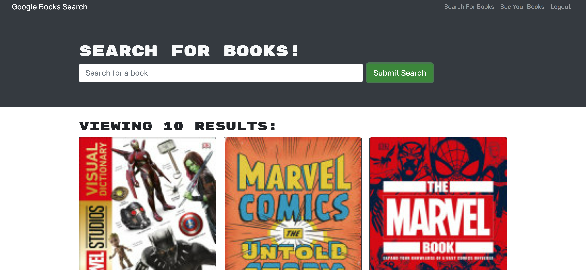

# mern-book-search-engine

## Description 
I wanted to build an application that demonstrated my skills with the MERN stack. This website uses MongoDB, Express, React, and Node to be a full stack application.
The site itself is a book search site. Any user can search for book. The real magic comes when a user is authenticated. An authenticated user can search book AND also save those books so they can view them again at a later time! Go find some books! 

### Application 

[Find a book now!](https://boiling-savannah-01104.herokuapp.com/)

#### Technologies Used
* MongoDB
* Express.js
* React
* Node.js

